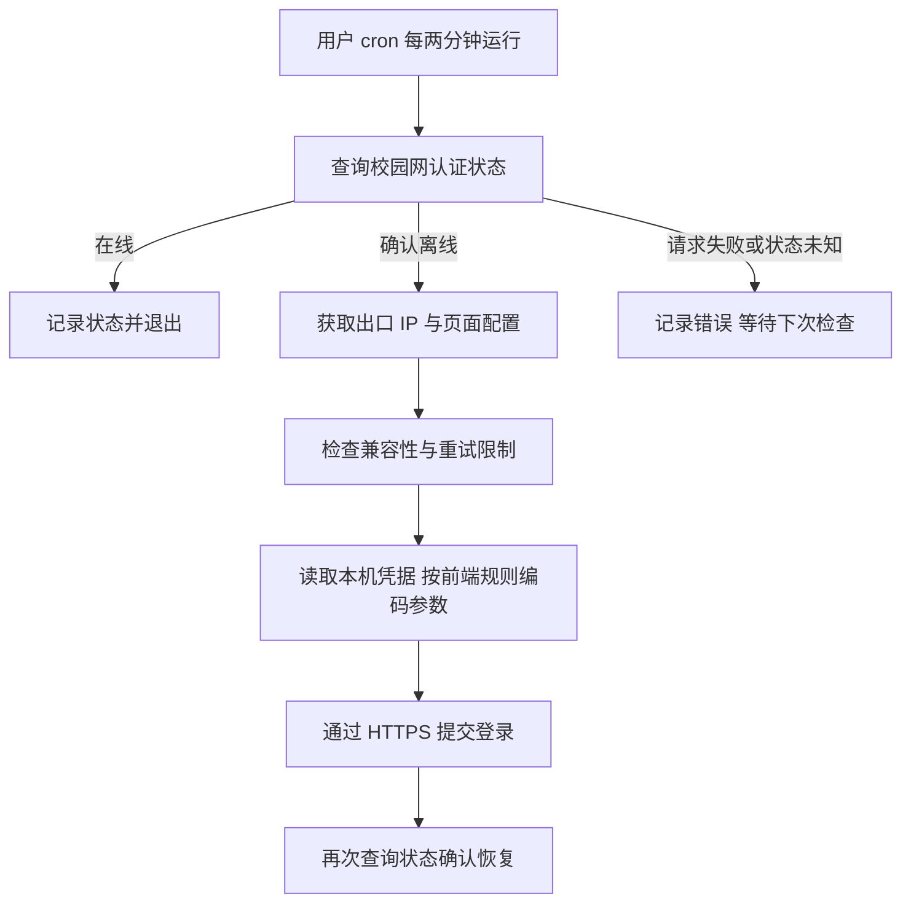

# TYUT校园网

太原理工校园网断连后，自动重连。

Linux 普通用户可运行的 Dr.COM 校园网自动认证脚本。服务器已接入校园网络、但网页认证掉线时，自动检测并重新登录。不需要 root，不依赖 SSH 持续连接，只使用 Python 标准库。

## 安装与配置

需要 Linux、Python 3.8+、已运行的 cron 服务，以及用户使用 `crontab` 的权限。服务器需已通过网线或 Wi-Fi 接入校园网络；程序不配置 Wi-Fi、网卡或路由器。定时任务使用 `/usr/bin/python3`，请确认该路径存在。

在需要自动联网的服务器上执行：

```bash
git clone https://github.com/HouXinyv/TYUT-campus-network.git
cd TYUT-campus-network
sh install.sh
python3 ~/.local/share/tyut-autologin/autologin.py setup
```

根据提示输入正常网页登录使用的校园网账号和两遍密码，不要自行添加客户端前缀。密码隐藏输入，不要将密码写在命令行、Issue 或聊天中。安装和配置不会主动注销网络。

检查并启用：

```bash
python3 ~/.local/share/tyut-autologin/autologin.py inspect
python3 ~/.local/share/tyut-autologin/autologin.py run
python3 ~/.local/share/tyut-autologin/autologin.py enable
crontab -l
```

`inspect` 检查状态、前端配置及模板兼容性，不读密码、不提交登录。`run` 在线时跳过登录，确认离线才读取凭据并认证。`enable` 安装每两分钟执行一次的用户级定时任务，重复执行不会重复添加任务，并保留其他 cron 行。

## 实现原理



- 状态接口：`https://drcom.tyut.edu.cn/drcom/chkstatus`。
- 登录接口：`https://drcom.tyut.edu.cn:804/eportal/portal/login`。
- 动态读取学校前端配置，取得参数编码方式、账号前后缀等。认证 IP 从门户获取，不把服务器局域网 IP 写死。
- 仅在本进程内将认证域名解析到已核实的门户 IP `219.226.127.250`，避免未认证时依赖外部 DNS。HTTPS Host、SNI 和证书校验仍使用 `drcom.tyut.edu.cn`；不修改系统 DNS，不跳过证书验证。学校更换地址后需要维护此配置。
- 禁用系统代理并拒绝 HTTP 重定向，防止认证请求被意外转发。
- 认证失效时网卡往往仍显示已连接，因此不能只靠网卡断线事件触发；周期查询认证状态用于发现这种情况。

## 功能和边界

- 普通用户运行；退出 SSH 后 cron 继续执行。重启后需系统 cron 正常启动、用户目录可访问。
- 在线时只查询状态，不读密码、不重复认证。
- 文件锁防止并发登录。
- 未确认成功的登录之间至少间隔五分钟；连续三次未确认成功后进入 30 分钟冷却，冷却结束会自动恢复尝试；如果之后检测到在线，会自动清除旧失败计数。
- 日志包含时间、阶段、耗时、错误分类和有限结果码；超过约 500 KB 时轮换，保留一个旧文件。
- 不主动注销、不重启网络、不改路由器。仓库不包含开发用的注销及解绑测试脚本。
- 当前支持识别到的 `login_method=1` 账号密码流程。显式验证码或不支持的配置会阻止认证。不能修复物理断网、上游停网、账号停用或交互式短信验证码问题。

## 文件位置和密码保护

运行文件位于当前用户的 `~/.local/share/tyut-autologin/`，不放在 Git 仓库里。

| 文件 | 作用 |
| --- | --- |
| `autologin.py` | 已安装的主程序 |
| `credentials.json` | `setup` 创建的账号密码文件 |
| `events.log`、`events.log.1` | 当前及轮换日志 |
| `retry.json` | 重试时间与计数 |
| `run.lock` | 防止并发登录 |

目录权限 `700`，凭据文件权限 `600`。读取凭据时检查文件类型、所有者、权限并拒绝符号链接。密码文件是**本机明文 JSON**，其他普通用户不能直接读取；**无法防止 root 或已控制同一用户的进程访问**。程序禁用 core dump 并限制进程可转储性，但这不改变 root 的权限边界。

协议参数编码可逆，不是密码存储加密，传输保护依靠 HTTPS。脚本不记录完整请求 URL、账号、密码、服务器原始响应或包含 URL 的异常文本。校园网认证服务器必然接收认证信息，客户端不能保证服务端日志策略。

## 日常操作

```bash
# 查询状态，不读密码
python3 ~/.local/share/tyut-autologin/autologin.py status

# 查看脱敏日志
tail -n 60 ~/.local/share/tyut-autologin/events.log

# 修改账号密码，重新隐藏输入
python3 ~/.local/share/tyut-autologin/autologin.py setup

# 处理问题后解除重试暂停
python3 ~/.local/share/tyut-autologin/autologin.py reset-retries

# 停用自动检查，保留配置
python3 ~/.local/share/tyut-autologin/autologin.py disable
```

错误示例：`HTTP_FAILED stage=status category=NETWORK_TIMEOUT`。`DNS_FAILURE`、`TLS_FAILURE`、`HTTP_STATUS_*`、`NETWORK_ERROR_*` 区分解析、证书、HTTP 和网络错误。`LOGIN_OK` 表示提交认证后重新查询确认在线。

`PAUSED` 表示当前处于重试冷却；冷却结束会自动恢复。解决账号或网络问题后也可以执行 `reset-retries` 立即清除计数。`SafeError` 表示配置或安全检查未通过，可执行 `inspect` 复查；当前实现不输出详细异常原文。排障时只分享脱敏日志，不上传凭据文件。

### 调整检查频率

默认两分钟。在线时主要开销是一个短暂的 Python 进程和一次状态请求。用 `crontab -e` 将本程序所在行的 `*/2` 改为 `*/10`，即可每十分钟检查。保留行末 `# tyut-autologin managed` 标记，供 `disable` 正确移除。再次执行 `enable` 会恢复默认两分钟配置。

意外掉线后，可能等待接近完整检查周期，再加上认证耗时。

## 测试记录

在一台 Linux 服务器上完成真实注销恢复测试：先确认离线，cron 提交登录，接口返回成功，再次确认在线，SSH 和外网 HTTPS 恢复。从注销请求到确认恢复约 21 秒。此前失败停在状态请求阶段；绕过外部 DNS 依赖后测试通过，但旧日志不足以证明前一次失败仅由 DNS 导致。

这验证了一次受控注销恢复，不代表已验证每天固定时段掉线原因或所有校区环境。

离线单元测试不访问校园网，不需要真实凭据：

```bash
python3 -m unittest discover -s tests -v
```

## 更新与卸载

更新不会覆盖已有凭据，也不改变现有 cron 配置：

```bash
git pull --ff-only
sh install.sh
python3 ~/.local/share/tyut-autologin/autologin.py inspect
```

卸载先移除任务，再删除本程序目录（含本机凭据和日志）：

```bash
python3 ~/.local/share/tyut-autologin/autologin.py disable
rm -rf -- "$HOME/.local/share/tyut-autologin"
```

## 发布范围

仓库只含客户端代码、安装脚本、测试和文档。不含真实账号密码、Wi-Fi 密码、实验室设备地址、运行日志、原始校园网页或会话记录。`.gitignore` 排除凭据和运行文件，但不能替代提交前检查。

使用本人获授权的校园网账号完成正常认证。本项目为个人工具，不是学校官方客户端。
